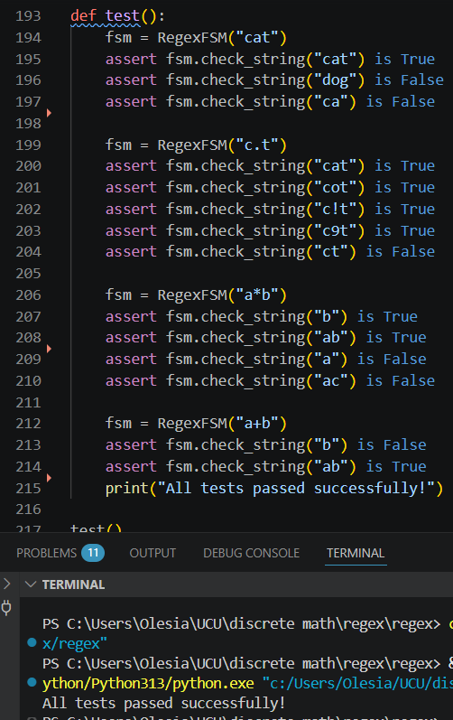

# Regex FSM

Цей проєкт представляє собою власну імплементацію механізму регулярних виразів, побудовану на основі скінченних автоматів.

---

## Звіт про виконану роботу

В рамках завдання було розроблено систему для розпізнавання текстових патернів.

* Підтримка ASCII літер та цифр.
* Реалізовано `.`, що відповідає будь-якому символу.
* `*` — нуль або більше повторень попереднього елемента.
* `+` — одне або більше повторень попереднього елемента.
* Реалізовано відповідності всього рядка заданому патерну.

---

## Пояснення імплементації


* `AsciiState`: Перевіряє відповідність конкретному ASCII символу.
* `DotState`: Відповідає будь-якому вхідному символу.
* `StarState`: Реалізує логіку "0 або більше", посилаючись на внутрішній стан (checking_state) та дозволяючи циклічні переходи.
* `PlusState`: Реалізує логіку "1 або більше", вимагаючи хоча б одну успішну перевірку внутрішнього стану.
* `TerminationState`: Фінальний стан, що сигналізує про успішне завершення розпізнавання рядка.

### Побудова графа
Під час ініціалізації об'єкта `RegexFSM`, по рядку регулярного виразу проходимось ітеративно. Кожен символ перетворюється на об'єкт стану, який додається до списку `next_states` попереднього стану, формуючи спрямований граф. Символи * та + модифікують зв'язки вже існуючих станів у графі.

### Перевірка
Метод `check_string` проходить по тексту, оновлюючи поточний стан автомата. Автомат стартує з `StartState`. Для кожного символу в тексті викликається метод `check_next()`, який шукає валідний наступний стан серед `next_states`. Якщо символ не відповідає жодному стану, викидається `NotImplementedError`, що повертає `False`. В кінці виконується перевірка `can_terminate()`, яка визначає, чи може поточний стан призвести до `TerminationState`.

---

## Інструкції до запуску


### Приклад коду
```python
from regex import RegexFSM

# Створення об'єкта
regex = RegexFSM("a*b.c+")

# Перевірка
print(regex.check_string("aaabxc")) # True
```

Для запуску готових тестів
```python
python regex.py
```
---

### Приклади запуску


